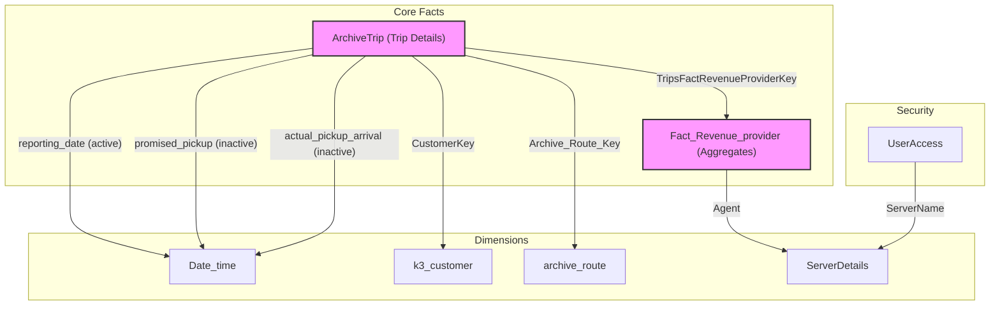

# Data Model and Inference Relationships

## Overview
The Power BI data model is a star schema centered around two primary fact tables: `ArchiveTrip` (transactional trip data) and `Fact_Revenue_provider` (aggregated performance metrics). A central `Date_time` dimension is used for time-based analysis, and numerous other dimension tables provide context for trips, customers, vehicles, and drivers.

## Core Tables

### Fact Tables
- **`ArchiveTrip`**: This is the most granular fact table, containing one row per trip leg. It includes details on status (`comp`, `noshow`, `cancel`), timings (promised, requested, actual), locations, passenger information, and keys to other dimensions.
- **`Fact_Revenue_provider`**: This table contains pre-aggregated performance metrics, likely at a daily or trip level. It includes measures like `completedTrips`, `estPassengerMiles`, `actRevenueHours`, and `actRevenueDistance`. It links directly to `ArchiveTrip`.
- **`Inspection`**: Contains records of vehicle inspections, including results (`pass`, `fail`) and details of inspected items.
- **`feedback_issues`**: Logs feedback and issues, linked to trips, customers, and drivers.
- **`UsedandFreeCapacity`**: A snapshot table that records the used and free capacity of vehicles at specific stops and times, useful for utilization analysis.
- **`Stop Performance`**: Contains performance metrics for individual stops within a run.
- **`Archive_Stops`**: Contains stop-level data with distance validation metrics.

### Dimension Tables
- **`Date_time`**: The primary date dimension, used for filtering and grouping by date, month, quarter, and year.
- **`k3_customer`**: Contains customer information, including name and number. Links to `ArchiveTrip`.
- **`archive_route`**: Contains information about routes, including the company and public ID. Links to `ArchiveTrip`.
- **`ServerDetails`**: A dimension for the different servers/agencies in the system.
- **`UserAccess`**: A security table that maps user emails to the `ServerName` they are allowed to see. This is used for Row-Level Security (RLS).
- **`Parameter/Sort Tables`**: Several small, disconnected tables are used to provide values for slicers or to enforce specific sort orders in visuals (e.g., `MIles_Bucket_SortOrder`, `Trip Types`, `PickupLatenessOrder`).

## DAX Measures by Table

### From Fact_Revenue_provider Table

**Daily Averages:**
- `[AverageDailyCompletedPassengerTrips]` - Average completed passenger trips per day
- `[AverageDailyRevenueHours]` - Average revenue hours per day
- `[AverageDailyRevenueMiles]` - Average revenue miles per day
- `[AverageDailyServiceMiles]` - Average service miles per day
- `[AvgDailyServiceHours]` - Average service hours per day

**Percentages:**
- `[DailyRevenueHours%]` - Ratio of average daily revenue hours to service hours
- `[DailyRevenueMiles%]` - Ratio of average daily revenue miles to service miles

**Maximum Daily Values:**
- `[MAXDailyCompletedPassengerTrips]` - Maximum completed passenger trips on any single day
- `[MaxDailyRevenueHours]` - Maximum revenue hours on any single day
- `[MaxDailyRevenueMiles]` - Maximum revenue miles on any single day
- `[MaxDailyServiceHours]` - Maximum service hours on any single day
- `[MaxDailyServiceMiles]` - Maximum service miles on any single day

**Minimum Daily Values:**
- `[MinDailyCompletedPassengerTrips]` - Minimum completed passenger trips on any single day
- `[MinDailyRevenueMiles]` - Minimum revenue miles on any single day
- `[MinDailyServiceHours]` - Minimum service hours on any single day
- `[MinDailyServiceMiles]` - Minimum service miles on any single day
- `[MinDailyRevenueHours]` - Minimum revenue hours on any single day

**Efficiency Metrics:**
- `[Total_rides]` - Simple calculation of completed passenger trips
- `[RidesPerHour]` - Number of rides divided by revenue hours
- `[MinRidesPerHour]` - Minimum rides per hour observed on any day
- `[MaxRidesPerHour]` - Maximum rides per hour observed on any day

**Totals:**
- `[RevenueHours]` - Sum of actual revenue hours
- `[RevenueMiles]` - Sum of actual revenue distance
- `[ServiceHours]` - Sum of actual service hours
- `[ServiceMiles]` - Sum of actual service distance

### From ArchiveTrip Table

**Performance Metrics:**
- `[Count of id MoM%]` - Month-over-month percentage change in trip count
- `[Dropoff_OTP%]` - On-time performance percentage for drop-offs
- `[PickUp_OTP%]` - On-time performance percentage for pickups

**Daily Averages:**
- `[AvgDailyPassenger]` - Average number of passengers per day
- `[MaxAvgDailyTrips]` - Maximum average number of daily trips
- `[MinAvgDailyTrips]` - Minimum average number of daily trips
- `[AvgDailyTrips]` - Average number of trips per day
- `[AvgDailyTripMiles]` - Average miles per trip per day
- `[AvgDailyESTTripMiles]` - Average estimated miles per trip per day

**Trip Type Counts:**
- `[Ambulatory]` - Count of completed trips for ambulatory passengers
- `[Wheelchair]` - Count of completed trips for wheelchair passengers

**Time-Based Averages:**
- `[AvgPassengerPerPromisedday]` - Average passengers per day based on promised pickup date
- `[AverageFareCashTotal]` - Average total cash fare collected per day

**Trip Counts by Status:**
- `[PassengerTrips_completed]` - Total count of completed passenger trips
- `[PassengerTrips_noshow]` - Total count of "no-show" passenger trips
- `[Passenger_trips_other]` - Count of trips with statuses other than "cancel", "comp", or "noshow"

**Trip Metrics:**
- `[Total_trips_miles]` - Total actual miles for all completed trips
- `[AverageTripsDuration]` - Average duration of a completed trip
- `[AverageTripsMiles]` - Average miles for a completed trip
- `[Total Trips]` - Total count of all trips in the ArchiveTrip table
- `[Passenger Trips]` - Sum of the passenger_count for all trips

### From Archive_Stops Table

**Stop Validation:**
- `[ValidStops]` - Counts stops where stop distance is within valid threshold (defined by ValidDistance slicer)
- `[InValidStops]` - Counts stops where stop distance is outside valid threshold

## Frequently Used Columns

### Primary Keys and Identifiers
- **`ArchiveTrip.id`** - Unique identifier for each trip record; primary field for counting trips
- **`ArchiveTrip.customer_internal_id`** - Links to customer dimension
- **`Fact_Revenue_provider.TripsFactRevenueProviderKey`** - Links fact tables

### Status and Classification
- **`ArchiveTrip.status`** - Trip status (e.g., "comp", "noshow", "cancel"); critical for filtering and segmentation
- **`ArchiveTrip.passenger_count`** - Number of passengers on a trip; used for volume calculations

### Date Fields (Time Intelligence)
- **`ArchiveTrip.reporting_date`** - Primary date field for time-based analysis (active relationship)
- **`ArchiveTrip.promised_pickup`** - Promised pickup time (inactive relationship)
- **`ArchiveTrip.actual_pickup_arrival`** - Actual pickup time (inactive relationship)
- **`Fact_Revenue_provider.RevenueProviderDate`** - Date for revenue metrics

### On-Time Performance
- **`ArchiveTrip.pickup_ontime`** - Indicates if pickup was "On-Time"
- **`ArchiveTrip.dropoff_ontime`** - Indicates if drop-off was "On-Time"
- These are core columns for calculating OTP metrics

### Performance Metrics (Fact_Revenue_provider)
- **`actRevenueHours`** - Actual revenue hours recorded
- **`actRevenueDistance`** - Actual revenue distance recorded
- **`actServiceHours`** - Actual service hours recorded
- **`actServiceDistance`** - Actual service distance recorded
- These are base values for key performance indicators

### Driver and Vehicle Identification
- **`ArchiveTrip.[Driver name]`** - Driver identifier for grouping and ranking
- **`Fact_Revenue_provider.[Vehicle ID]`** - Vehicle identifier for performance comparisons

### Location Fields
- **`ArchiveTrip.start_latitude`** / **`start_longitude`** - Pickup location coordinates
- **`ArchiveTrip.end_latitude`** / **`end_longitude`** - Drop-off location coordinates
- **`ArchiveTrip.start_location_name`** / **`end_location_name`** - Named pickup/drop-off points

## Key Relationships and Inference Logic

### Relationship Rules

1. **Centrality of `ArchiveTrip`**: Most queries will originate from or filter through the `ArchiveTrip` table. It connects trip details to customers, routes, and aggregated facts.

2. **`ArchiveTrip` to `Fact_Revenue_provider`**: The one-to-many relationship from `Fact_Revenue_provider` to `ArchiveTrip` (linked by `TripsFactRevenueProviderKey`) allows for drilling down from aggregated performance metrics to the individual trips that constitute them.

3. **Multiple Date Relationships**: The model uses inactive relationships for different date fields on the `ArchiveTrip` table:
   - **`reporting_date`** - Active relationship (default for time-based filtering)
   - **`promised_pickup`** - Inactive (use with USERELATIONSHIP for OTP calculations)
   - **`requested_pickup`** - Inactive (use for booking analysis)
   - **`actual_pickup_arrival`** - Inactive (use for actual performance analysis)
   
   **Inference**: When a user asks about dates, the agent must determine which date field is appropriate. DAX queries must activate the correct relationship using `USERELATIONSHIP()`.

4. **Row-Level Security (RLS)**: The `UserAccess` table enforces security by filtering data based on `UserEmail` matching `USERPRINCIPALNAME()`. This ensures users only see data for their assigned server/agency.

5. **Parameter Tables**: Tables like `Trip Types`, `NoshowFilter`, and `IncludeRuns` are used as slicers or what-if parameters. The agent may need to use selected values from these tables to filter measures appropriately.

## Report Pages and Visual Context

The Power BI report contains the following major pages, each with specific visuals and metrics:

### KPI Page
- Gauge visuals for key daily averages (revenue miles, revenue hours, completed trips, rides per hour)
- On-time performance gauge
- Trend charts comparing service vs. revenue metrics
- Top 5 vehicle rankings by various metrics

### Late and Early OTP Pages
- Donut charts showing pickup/drop-off OTP distribution
- Bar charts comparing driver performance
- Column charts showing delays by time bucket
- Line charts showing OTP by hour of day

### OTP Details Page
- Detailed trip table with timing information

### Drivers Page
- Driver performance table with multiple metrics
- Invalid stops percentage by driver
- Trips by driver and status

### Riders Page
- New clients vs. new riders trends
- Passenger trips by age bucket
- Average trips by hour and day of week
- Profile creation to first trip analysis

### Geospatial Analysis Page
- Azure maps for pickup/drop-off locations
- Top 10 pickup/drop-off POI tables

### Capacity Page
- Used vs. total capacity trends
- Capacity utilization by vehicle

### Pull Out to First Stop Performance Page
- Late pull-out and first stop performance over time
- Performance by driver and vehicle

### Window Placement Page
- Distribution of estimated vs. actual placement
- Mandatory trip analysis

### Bookings Page
- Subscription vs. demand trips
- Booking agents analysis
- Overbooking trends

This comprehensive structure guides the agent in understanding which measures and filters are relevant for different types of queries.